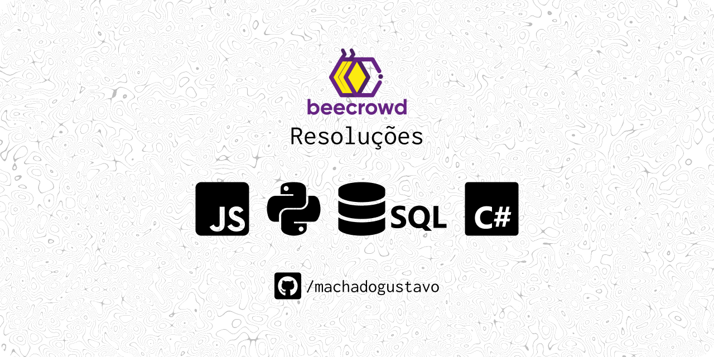

<h1>BeecrowdGustavo</h1>
<strong>Javascript, Python, C#, SQL</strong>

Resoluções de alguns desafios do
[Beecrowd](https://www.beecrowd.com.br/judge/pt/categories) 
para Web I e estudo.

    * Insira as entradas no arquivo .stdin.
